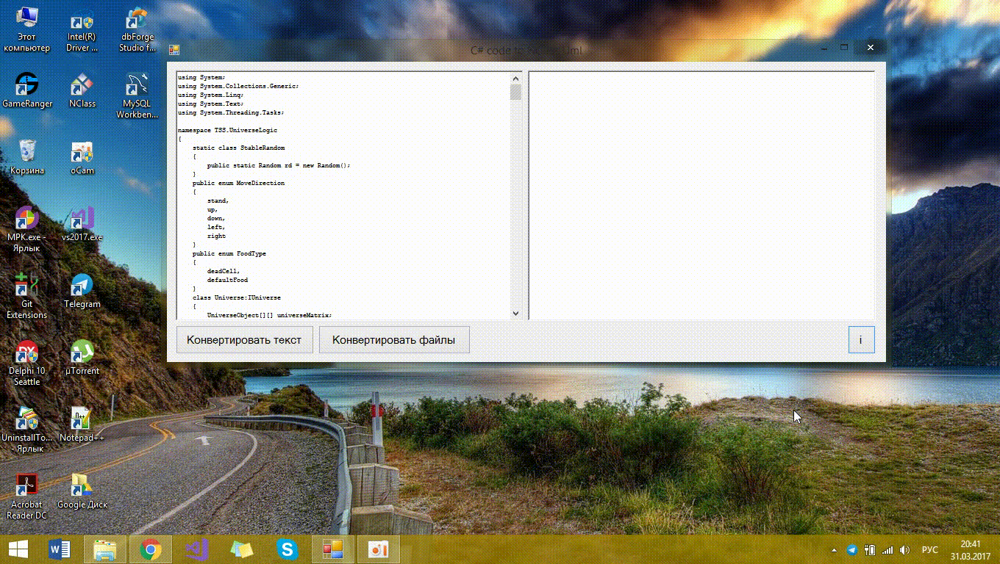

#  CSharp to NClass uml converter
 This project i wrote for few days to convert my college project to NClass files.
It have many bugs, but if you need to create uml from code, like my, you can use it. 
Probably you will have exceptions when will open this files in NClass. You must fix them manually.
 
 Work demo:

 
 
 Contacts:
 &nbsp;&nbsp;&nbsp;&nbsp;Vk - https://vk.com/yura_mysko
 &nbsp;&nbsp;&nbsp;&nbsp;Youtube - https://www.youtube.com/channel/UCiIj3Q0z1pNJ2KyNRcspoZw
 &nbsp;&nbsp;&nbsp;&nbsp;Habrahabr blog - https://habrahabr.ru/users/kogercoder/
 &nbsp;&nbsp;&nbsp;&nbsp;Telegram - https://t.me/yura_mysko